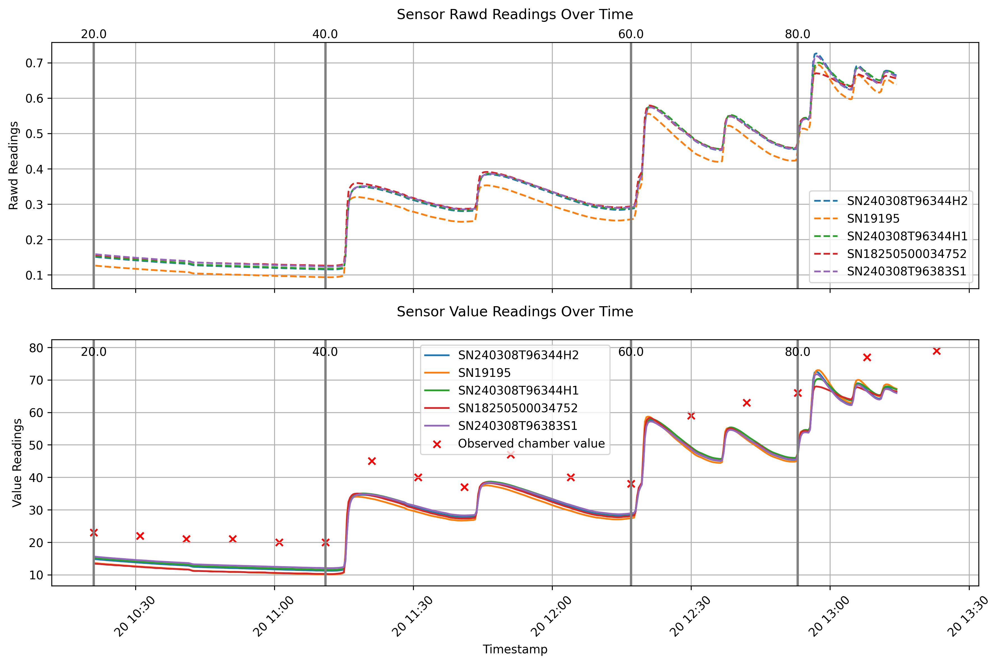

# lvcal_vis
A quick Python function for visualizing outputs of LVcal software

Useful for visualizing calibrations post-cal, to ensure that the best data points are chosen for calibration and the chamber is working as intended.

<!--  -->

Include the following:
* The `metcal.out` file

These are files specific to the humidity chamber, in case a standard is not available.
* The `obs.csv` file (for observed or known values, in case you need them)
* The `setpoints.csv` file (for demarcating when setpoints are adjusted)